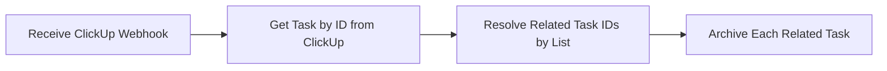

# ClickUp: Archive Relational Tasks

This workflow automatically archives tasks that are linked in a custom field of a parent ClickUp task when the parent task is updated.

## Overview

This workflow solves the problem of managing and cleaning up related tasks in ClickUp. For example, if you have a main project task and link several "Call" tasks to it via a custom "Task Relationship" field, this workflow can automatically archive all those "Call" tasks when the main task's status changes (e.g., to "Done"). This is particularly useful for project managers and teams who want to maintain a clean workspace by automatically archiving completed or dependent sub-tasks without manual intervention.

The end-to-end process is as follows:
1.  A ClickUp webhook is triggered by an event, such as a task status update.
2.  The workflow receives the webhook payload and fetches the full details of the updated task.
3.  A custom code node inspects the task's List ID to determine which custom field holds the related tasks.
4.  It extracts the IDs of all tasks linked in that specific custom field.
5.  Finally, it iterates through the list of related task IDs and sends an API request to ClickUp to archive each one.

## Prerequisites

To use this workflow, you will need the following:

*   An n8n instance.
*   A ClickUp account with permissions to create webhooks and access the API.

### Credentials

| Credential Type | Used By Node(s)                                                | Setup Reference                                                                          |
| :-------------- | :------------------------------------------------------------- | :--------------------------------------------------------------------------------------- |
| `clickUpApi`    | `Get Task by ID from ClickUp`, `Archive Each Related Task` | [ClickUp API Docs](https://docs.n8n.io/integrations/builtin/credentials/clickup/) |

## Workflow Architecture



### Trigger

The workflow is initiated by the **Receive ClickUp Webhook** node. It listens for `POST` requests sent from ClickUp whenever a configured event occurs in your workspace (e.g., a task status is updated).

### Node-by-Node Breakdown

#### 1. Receive ClickUp Webhook

*   **Purpose**: This node acts as the entry point, capturing real-time events from ClickUp.
*   **Configuration**: It is configured to listen for `POST` requests on the path `archive_relational_tasks`.
*   **Receives**: A JSON payload from the ClickUp webhook containing event details, including the ID of the task that triggered the event.
*   **Outputs**: The full webhook payload for the next node to process.

#### 2. Get Task by ID from ClickUp

*   **Purpose**: The initial webhook payload from ClickUp may not contain all task details, such as custom fields. This node fetches the complete task object using its ID.
*   **Configuration**:
    *   **Operation**: `Get`
    *   **ID**: `={{ $json["body"]["payload"]["id"] }}` - This expression dynamically retrieves the task ID from the body of the incoming webhook request.
*   **Receives**: The webhook data from the trigger.
*   **Outputs**: A single item containing the full JSON object for the ClickUp task.

#### 3. Resolve Related Task IDs by List

*   **Purpose**: This node contains the core business logic. It identifies which custom field to look for based on the task's parent list and extracts the IDs of any tasks linked within that field.
*   **Configuration**: The node uses custom JavaScript to perform this logic. Inside the code, a `fieldNameMap` object maps ClickUp List IDs to the names of the custom fields that contain the related tasks.
    ```javascript
    // Map list ID → which custom field holds the related Call task IDs.
    // List 901109645307 → field "Calls"
    // List 901109645497 → field "📞 Calls"
    const fieldNameMap = {
      "901109645307": "Calls",
      "901109645497": "📞 Calls"
    };
    ```
    If the task's list is found in the map, it searches the task's `custom_fields` array for a field with the matching name and extracts the IDs of the linked tasks.
*   **Receives**: The full task object from the "Get Task by ID from ClickUp" node.
*   **Outputs**: A separate item for each related task found. Each item is a JSON object with a single key, `taskId`. If no related tasks are found or the list is not in the map, it outputs nothing, and the workflow stops for that run.

#### 4. Archive Each Related Task

*   **Purpose**: This node runs for each related task identified by the previous node and archives it using the ClickUp API.
*   **Configuration**:
    *   **Method**: `PUT`
    *   **URL**: `=https://api.clickup.com/api/v2/task/{{ $json["taskId"] }}` - The URL is constructed dynamically using the `taskId` from the input item.
    *   **Authentication**: Uses the pre-configured `clickUpApi` credential.
    *   **Body**: A JSON body is sent with the request: `={ "archived": true }` to set the task's status to archived.
*   **Receives**: An item containing the `taskId` of a related task.
*   **Outputs**: The API response from ClickUp confirming the archive operation.

## Configuration Guide

Follow these steps to set up and configure the workflow.

1.  **Import Workflow**: Copy the workflow JSON and import it into your n8n instance.

2.  **Configure Credentials**:
    *   Open the **Get Task by ID from ClickUp** node.
    *   Select your ClickUp API credential from the "Credential for ClickUp API" dropdown or create a new one.
    *   Repeat this step for the **Archive Each Related Task** node.

3.  **Customize the Code Node**:
    *   Open the **Resolve Related Task IDs by List** node.
    *   You **must** edit the `fieldNameMap` object in the JavaScript code.
    *   Replace the example List IDs (`"901109645307"`, `"901109645497"`) with the actual IDs of your ClickUp lists.
    *   Replace the example Custom Field names (`"Calls"`, `"📞 Calls"`) with the names of your "Task Relationship" custom fields where the related tasks are linked.

4.  **Configure ClickUp Webhook**:
    *   Open the **Receive ClickUp Webhook** node.
    *   Copy the **Test URL**.
    *   In your ClickUp workspace, go to **Settings > Integrations > API > Webhooks**.
    *   Create a new webhook, paste the Test URL, and select the events that should trigger this workflow (e.g., `taskStatusUpdated`).
    *   Save the webhook in ClickUp.

5.  **Test the Workflow**:
    *   In n8n, click "Test workflow" on the workflow canvas. The trigger node will now be listening for an event.
    *   In ClickUp, perform the action you configured as the trigger (e.g., change a task's status).
    *   Verify that the workflow executes successfully in n8n and that the related tasks are archived in ClickUp.

6.  **Activate the Workflow**:
    *   Once testing is complete, save and activate the workflow in n8n.
    *   Go back to the **Receive ClickUp Webhook** node and copy the **Production URL**.
    *   Update the webhook URL in your ClickUp settings to use the Production URL.

> **Important**
> Remember to switch your ClickUp webhook from the test URL to the production URL after you activate the workflow. Otherwise, the workflow will not run automatically.

## Error Handling

*   This workflow does not have an explicit error handling branch. If a node fails (e.g., the ClickUp API is down), the workflow execution will fail for that item.
*   The **Resolve Related Task IDs by List** node includes logic to prevent errors. If a task from a list not defined in its `fieldNameMap` triggers the webhook, the node will simply output no items, and the workflow will stop gracefully for that run without proceeding to the archive step.

## Metadata

| Property            | Value                                        |
| :------------------ | :------------------------------------------- |
| **Workflow ID**     | `D9hw5XzhOoFoG6gz`                           |
| **Active Status**   | `true`                                       |
| **Tags**            | *None*                                       |
| **Node Count**      | 4                                            |
| **Integrations**    | Webhook, ClickUp, Code, HTTP Request         |